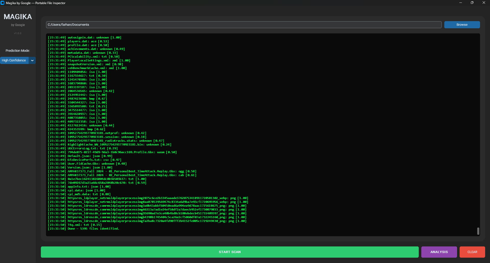
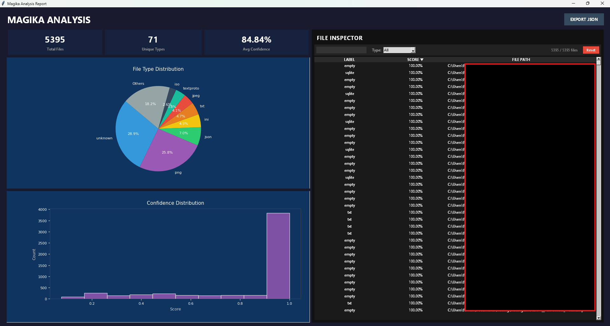

<div align="center">

# 🔍 Magika GUI — Portable AI File Inspector

**The ultimate deep-learning powered file identification tool — no installation required.**

[](https://opensource.org/licenses/MIT)
[](https://www.python.org/)
[](https://google.github.io/magika/)
[]()

<br>

> **Identify any file's true type using Google's deep learning model — even if the extension is changed, missing, or deliberately obfuscated.**

<br>



</div>

---

## ⚡ What is this?

**Magika GUI** wraps [Google's Magika](https://github.com/google/magika) — a state-of-the-art AI file identification system — into a beautiful, portable desktop application. No Python knowledge needed. No command line required. Just download, run, and scan.

Magika uses a custom deep learning model (not simple "magic bytes") trained on **millions of files** to identify over **100+ file types** with >99% precision. It's the same technology Google uses internally at scale.

This GUI makes all of that power accessible to **security researchers**, **forensic analysts**, **penetration testers**, and **curious power users**.

---

## 🎯 Features

### 🧠 AI-Powered Identification
- Detects the **true file type** regardless of extension or obfuscation
- Powered by Google's production-grade deep learning model (ONNX)
- Returns a **confidence score** for every identification

### 📊 Visual Analysis Dashboard
- **Pie Chart** — File type distribution across your scanned directory
- **Histogram** — Confidence score distribution
- **Stat Cards** — Total files, unique types, average confidence at a glance

### 🔎 Deep File Inspector
- **Sortable columns** — Click LABEL (A→Z) or SCORE (▲▼) to sort
- **Type filter** — Dropdown to filter by any detected file type
- **Live search** — Find specific files by name instantly
- **Status counter** — "Showing X / Y files" always visible

### ⚙️ Configurable Detection Engine
- **High Confidence** — Maximum precision, fewer false positives
- **Medium Confidence** — Balanced mode
- **Best Guess** — Maximum recall, catches edge cases

### 📤 Export & Reporting
- **JSON Export** — Save complete scan results for further analysis
- Export includes: filename, label, MIME type, and confidence score

### 🖥️ Portable & Zero-Install
- Single `.exe` file — no Python, no dependencies, no installation
- Dark-themed professional UI
- Proper memory cleanup — no zombie processes

---

## 📸 Screenshots

<div align="center">

| Main Scanner | Analysis Dashboard |
|:---:|:---:|
|  |  |

</div>

---

## 🚀 Quick Start

### Option A: Download the Portable EXE (Recommended)
1. Go to [**Releases**](../../releases)
2. Download `magika-gui-portable.exe`
3. Double-click to run — that's it!

### Option B: Run from Source
```bash
# Clone the repo
git clone https://github.com/YOUR_USERNAME/magika-gui.git
cd magika-gui

# Install dependencies
pip install -r requirements.txt

# Launch
python main.py
```

### Option C: Build the EXE Yourself
```bash
pip install -r requirements.txt
pyinstaller --noconfirm --onefile --windowed \
  --name magika-gui-portable \
  --add-data "PATH_TO_SITE_PACKAGES/magika/models;magika/models" \
  --add-data "PATH_TO_SITE_PACKAGES/magika/config;magika/config" \
  --add-data "PATH_TO_SITE_PACKAGES/customtkinter;customtkinter" \
  main.py
```

---

## 🛠️ How It Works

```
┌─────────────┐    ┌──────────────┐    ┌─────────────────┐
│  Select Dir  │───▶│  Walk Files  │───▶│  Magika Engine  │
└─────────────┘    └──────────────┘    │  (ONNX Model)   │
                                       └────────┬────────┘
                                                │
                         ┌──────────────────────┤
                         ▼                      ▼
                   ┌──────────┐          ┌─────────────┐
                   │ Terminal  │          │  Analysis    │
                   │  Output   │          │  Dashboard   │
                   └──────────┘          └─────────────┘
```

1. **Select** a folder to scan
2. Magika's neural network **analyzes** each file's binary content
3. Results stream to the **terminal** in real-time
4. Click **ANALYSIS** for the full visual dashboard
5. **Filter, sort, search** and **export** your findings

---

## 🔬 Use Cases

| Scenario | How Magika GUI Helps |
|----------|---------------------|
| **Malware Analysis** | Identify executables disguised as documents |
| **Forensic Investigation** | Detect true file types in evidence images |
| **Data Auditing** | Find misclassified files in large datasets |
| **Security Testing** | Verify that upload filters can't be bypassed |
| **Curiosity** | Discover what's really inside any file |

---

## 📦 Tech Stack

| Component | Technology |
|-----------|-----------|
| AI Engine | [Google Magika](https://github.com/google/magika) (ONNX Runtime) |
| GUI Framework | [CustomTkinter](https://github.com/TomSchimansky/CustomTkinter) |
| Charts | [Matplotlib](https://matplotlib.org/) (Object-Oriented API) |
| File List | Native `ttk.Treeview` (high-performance) |
| Packaging | [PyInstaller](https://pyinstaller.org/) |

---

## 📋 Requirements (Source Only)

```
magika
customtkinter
matplotlib
pyinstaller
```

Python **3.10+** required.

---

## ⚠️ Disclaimer

> **This application is NOT an officially supported Google project.**
> It is solely a personal project created for **experimentation and educational purposes only**.
>
> This project uses Google's open-source [Magika](https://github.com/google/magika) library
> under its [Apache 2.0 License](https://github.com/google/magika/blob/main/LICENSE).
> The GUI wrapper is an independent, community-built tool and is not endorsed,
> maintained, or affiliated with Google LLC in any way.
>
> Use at your own risk. The authors assume no liability for any misuse of this software.

---

## 📄 License

This project is licensed under the **MIT License** — see the [LICENSE](LICENSE) file for details.

The underlying Magika engine is licensed under **Apache 2.0** by Google.

---

## 🤝 Contributing

Contributions are welcome! Feel free to:
- 🐛 Report bugs via [Issues](../../issues)
- 💡 Suggest features
- 🔧 Submit pull requests

---

## ⭐ Star History

If you find this useful, please consider giving it a ⭐ — it helps others discover the project!

---

<div align="center">

**Built with ❤️ using Google's Magika AI**

*Identify. Inspect. Investigate.*

</div>
